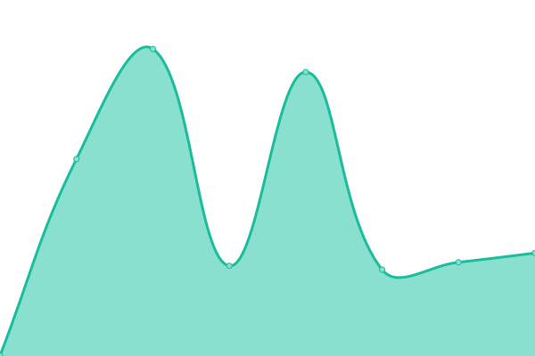

# [📈 Live Status](https://demo.upptime.js.org): <!--live status--> **🟩 All systems operational**

This repository contains the open-source uptime monitor and status page for [Lego Chan](https://demo.upptime.js.org), powered by [Upptime](https://github.com/upptime/upptime).

With [Upptime](https://upptime.js.org), you can get your own unlimited and free uptime monitor and status page, powered entirely by a GitHub repository. We use [Issues](https://github.com/legochancw/upptime_som/issues) as incident reports, [Actions](https://github.com/legochancw/upptime_som/actions) as uptime monitors, and [Pages](https://demo.upptime.js.org) for the status page.

<!--start: status pages-->
<!-- This summary is generated by Upptime (https://github.com/upptime/upptime) -->
<!-- Do not edit this manually, your changes will be overwritten -->
<!-- prettier-ignore -->
| URL | Status | History | Response Time | Uptime |
| --- | ------ | ------- | ------------- | ------ |
|  [Production - EMAT Support](https://support.mattex.com.hk) | 🟩 Up | [production-emat-support.yml](https://github.com/legochancw/upptime_som/commits/HEAD/history/production-emat-support.yml) | 

 431ms
     
 | 

<a href="https://upptime.fours.app/history/production-emat-support">100.00%</a>
    

|  [Development - EMAT Support](https://dev-support.mattex.com.hk) | 🟩 Up | [development-emat-support.yml](https://github.com/legochancw/upptime_som/commits/HEAD/history/development-emat-support.yml) | 

 522ms
     
 | 

<a href="https://upptime.fours.app/history/development-emat-support">100.00%</a>
    

|  [SOM Web Portal](https://som.mattex.com.hk) | 🟩 Up | [som-web-portal.yml](https://github.com/legochancw/upptime_som/commits/HEAD/history/som-web-portal.yml) | 

 1702ms
     
 | 

<a href="https://upptime.fours.app/history/som-web-portal">0.00%</a>
    

|  [SOM - API (Auth)](https://api.fours.app/auth) | 🟩 Up | [som-api-auth.yml](https://github.com/legochancw/upptime_som/commits/HEAD/history/som-api-auth.yml) | 

 577ms
     
 | 

<a href="https://upptime.fours.app/history/som-api-auth">0.00%</a>
    

|  [SOM - API (CIS-Project)](https://api.fours.app/cis/projects) | 🟩 Up | [som-api-cis-project.yml](https://github.com/legochancw/upptime_som/commits/HEAD/history/som-api-cis-project.yml) | 

 770ms
     
 | 

<a href="https://upptime.fours.app/history/som-api-cis-project">0.00%</a>
    

|  [SOM - Konga](https://konga.fours.app) | 🟩 Up | [som-konga.yml](https://github.com/legochancw/upptime_som/commits/HEAD/history/som-konga.yml) | 

 1329ms
     
 | 

<a href="https://upptime.fours.app/history/som-konga">0.00%</a>
    

<!--end: status pages-->

[**Visit our status website →**](https://demo.upptime.js.org)

## 📄 License

- Powered by: [Upptime](https://github.com/upptime/upptime)
- Code: [MIT](./LICENSE) © [Lego Chan](https://demo.upptime.js.org)
- Data in the `./history` directory: [Open Database License](https://opendatacommons.org/licenses/odbl/1-0/)
